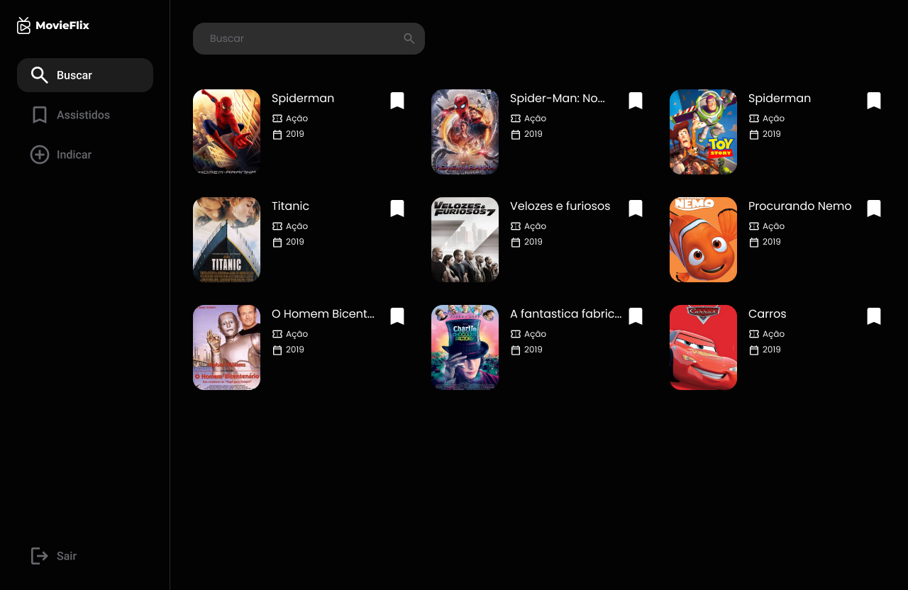

<h1 align="center">
  
</h1>

<h3 align="center">
  Aplicação de busca e listagem de filmes assistidos
</h3>

<p align="center">
  

  

  
</p>

<p align="center">
  
</p>

> [Visualizar live demo](https://movie-flix-guihenrry.vercel.app/)

> [Visualizar layout no Figma](https://www.figma.com/file/E3UR7RQtefuLh8Cu2UocrC/MovieFlix-Plus-FIAP-Tech-Challenge?type=design&node-id=5%3A2&mode=dev&t=EYfhgvjw1R15w86H-1)

## Integrantes do Grupo M

Guilherme Henrry Batista Damasceno
guilhermehenry60@gmail.com

Douglas Soares de Oliveira
soares.douglas.oliveira@hotmail.com

Débora Goulart Bartosiaki
debartosiaki@gmail.com

## Sobre

MovieFlix é a sua plataforma definitiva para descobrir e organizar seus filmes assistidos. Com uma vasta biblioteca de filmes de todos os gêneros e épocas, MovieFlix torna mais fácil do que nunca encontrar os filmes que você adora e explorar novos favoritos.

### Video do funcionamento da aplicação

https://www.loom.com/share/0bc470e7b48543ac84561117995193dc?sid=495731f2-102a-4d6e-8bd8-d6b2570f1f73

## Como utilizar

Primeiro passo é clonar esse repositório

```bash
git clone https://github.com/Guihenrry/movie-flix.git
```

Este repositório contém aplicação backend, frontend. Por isso separei o processo de instalação para cada ambiente.

- [backend](https://github.com/Guihenrry/movie-flix/blob/main/backend/README.md)
- [frontend](https://github.com/Guihenrry/movie-flix/blob/main/frontend/README.md)

## Repositório do GitHub

Você pode encontrar o código-fonte e os arquivos relacionados a este projeto no seguinte repositório do GitHub:

https://github.com/Guihenrry/movie-flix
